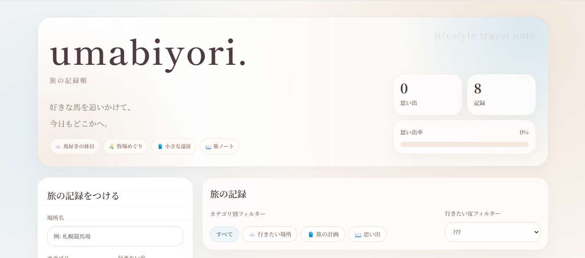

# umabiyori.



**「好きな馬を追いかけて、今日もどこかへ。」**

「umabiyori.」は、競馬場や牧場などの旅先を記録・管理するためのWebアプリです。
訪れた場所の思い出や、これから行きたい場所を一冊の旅ノートのように残せるサービスを目指して制作しました。

---

## 制作目的

* Webアプリ制作の学習
* CRUD（登録・編集・削除）機能の実装
* LocalStorageを活用したデータ保存の学習

## ターゲット

* 競馬が好きな方
* 競馬場・牧場巡りを楽しむ方
* 旅の思い出を記録したい方

## 使用技術

* HTML5
* CSS3
* JavaScript
* LocalStorage

## 主な機能

* 旅先の登録
* 登録内容の編集・削除
* アーカイブ機能
* 行きたい度の管理
* カテゴリ別フィルター
* 訪問率の表示

## 工夫したポイント

* 「旅の記録」をテーマにしたシンプルで親しみやすいデザイン
* 登録・編集・削除を直感的に操作できるUI
* LocalStorageを利用し、ブラウザ上でデータを保存
* 行きたい場所と訪問済みの場所を分けて管理できる設計
* 競馬場だけでなく牧場や関連施設も記録できるようカテゴリを用意

## ディレクトリ構成

```text
umabiyori/
├── img/
├── index.html
└── README.md
```

## 公開ページ

https://pluto007-lab.github.io/umabiyori/

## 学んだこと

* JavaScriptによるCRUD処理の実装
* LocalStorageを利用したデータ保存
* ユーザーが継続して使いやすいUI設計
* GitHub Pagesを利用したWebアプリ公開

## 今後改善したい点

* ログイン機能の追加
* クラウド上へのデータ保存対応
* 地図表示や位置情報との連携
* 写真投稿機能やお気に入り機能の追加
* 「umalog.」との連携による旅の共有機能

## 制作

職業訓練校での個人制作として企画・制作。
コンセプト立案からUI設計、フロントエンド実装まで担当しました。
